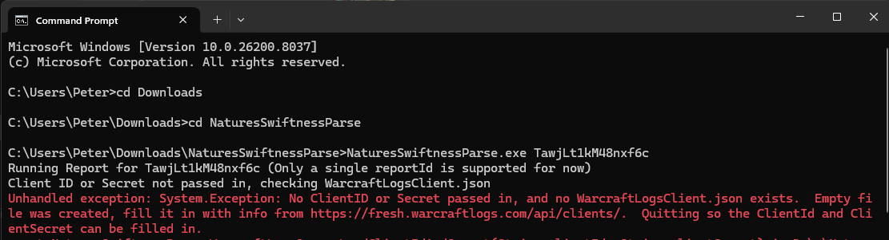
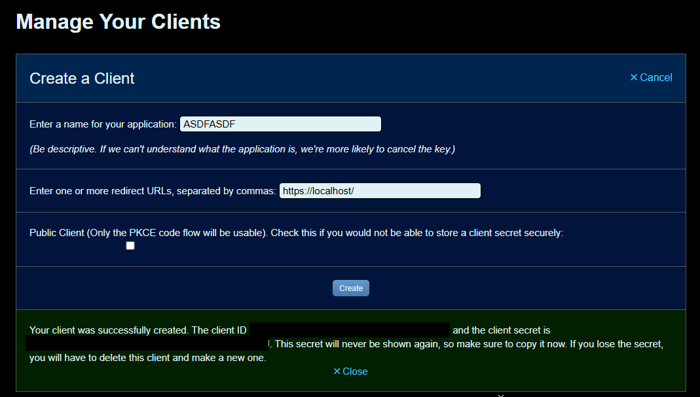

# NaturesSwiftnessParse

## Installation Instructions

1. Navigate to the raid log on WarcraftLogs, for our example here https://vanilla.warcraftlogs.com/reports/TawjLt1kM48nxf6c the id would be TawjLt1kM48nxf6c, and copy that ID

2. Download the latest release from here: https://github.com/yoyokazoo/NaturesSwiftnessParse/releases/tag/latest

3. Once you download the zip, you'll need to run it once from the command prompt:

	Start -> cmd -> navigate to where you unzipped it -> NaturesSwiftnessParse.exe TawjLt1kM48nxf6c

	

	It will fail the first time, but it will create an empty file called  like this:

	`{"ClientId":"FILL IN FROM https://fresh.warcraftlogs.com/api/clients/","ClientSecret":"FILL IN FROM https://fresh.warcraftlogs.com/api/clients/"}`

4. Go to https://fresh.warcraftlogs.com/api/clients/ -> Create Client

	

	Pick anything for the name, you have to put in a redirect but it doesn't do anything for this so I just use https://localhost/

	

5. Copy the ClientId and ClientSecret and paste them into WarcraftLogsClient.json.  Save and re-run the NaturesSwiftnessParse command.

6. You're good to go!  You can also add eventsToPrint to print more than just the top 5 (Discord paste limits you pretty soon after 5) by going:

	`NaturesSwiftnessParse.exe TawjLt1kM48nxf6c eventsToPrint 20`